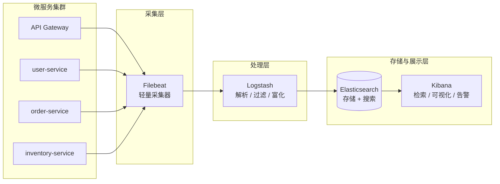
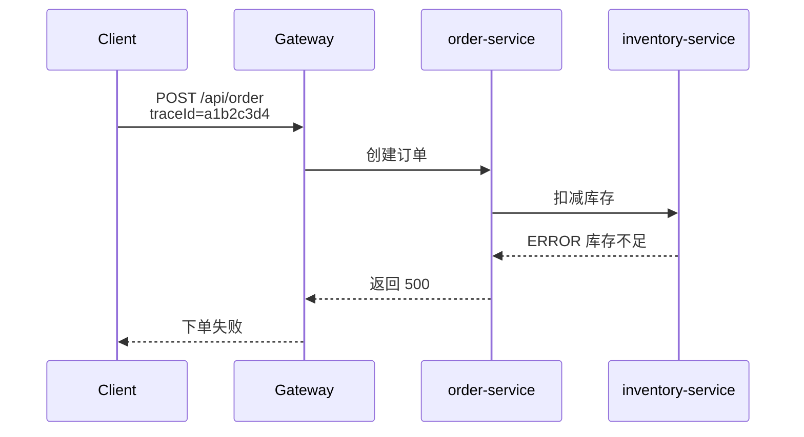

# ELK

> ELK 微服务日志实战：从零搭建到全链路排查

在微服务架构下，一次用户请求往往会跨越好几个服务。当线上出现「下单失败」这类问题时，如果还靠一台台机器登录上去 `grep` 日志，效率是灾难级的。ELK（Elasticsearch + Logstash + Kibana）就是解决这个问题的经典方案：**集中采集、统一存储、快速检索**。

本文从 Docker Compose 搭建一套本地 ELK 开始，先跑通最基础的文本日志采集，再用一个「微服务下单链路」实战案例，演示如何通过 traceId 在 Kibana 里一键还原完整调用链。

## 一、ELK 是什么

| 组件          | 作用        | 运维场景                     |
| ------------- | ----------- | ---------------------------- |
| Elasticsearch | 存储 + 搜索 | 日志、指标、错误、审计       |
| Logstash      | 日志处理    | 日志清洗、字段解析、富化     |
| Kibana        | 可视化      | 搜索日志、画图、告警         |
| Beats         | 轻量采集    | 部署在每台机器上采集日志转发 |

> 常说的 ELK 严格来说是 Elastic Stack。Beats（如 Filebeat）是轻量级采集器，生产环境一般是 `Filebeat → Logstash → Elasticsearch → Kibana` 的链路，Logstash 专注解析处理，采集交给更省资源的 Filebeat。

**经典运维场景**

- Nginx / Spring Boot / 容器日志集中管理
- 错误排查（500、超时、慢请求）
- 审计 / 安全日志分析

## 二、微服务下的日志架构

微服务环境的标准日志链路如下：



各层职责：

1. **微服务集群**：每个服务只负责把日志写到本地文件（或 stdout），业务代码不感知日志系统。
2. **采集层（Filebeat）**：以极低资源占用收集各服务日志，转发给 Logstash。
3. **处理层（Logstash）**：解析日志格式（Grok / JSON）、提取关键字段（level、traceId）、丢弃无用日志。
4. **存储与展示层**：Elasticsearch 按天建立索引存储日志，Kibana 提供检索和图表。

> 本地学习环境可以省略 Filebeat，让 Logstash 直接读日志文件，下文就是这样做的。

## 三、Docker Compose 快速部署

### 目录结构

```text
elk/
├── docker-compose.yml
├── logstash/
│   └── logstash.conf
└── logs/
    └── app.log
```

### docker-compose.yml

```yaml
version: "3.8"

services:
  elasticsearch:
    image: docker.elastic.co/elasticsearch/elasticsearch:8.11.1
    container_name: elasticsearch
    environment:
      - discovery.type=single-node
      - xpack.security.enabled=false   # 仅本地学习使用，生产必须开启认证
      - ES_JAVA_OPTS=-Xms512m -Xmx512m
    volumes:
      - esdata:/usr/share/elasticsearch/data
    ports:
      - "9200:9200"

  logstash:
    image: docker.elastic.co/logstash/logstash:8.11.1
    container_name: logstash
    volumes:
      - ./logstash/logstash.conf:/usr/share/logstash/pipeline/logstash.conf
      - ./logs:/logs
    ports:
      - "5044:5044"
    depends_on:
      - elasticsearch

  kibana:
    image: docker.elastic.co/kibana/kibana:8.11.1
    container_name: kibana
    environment:
      - ELASTICSEARCH_HOSTS=http://elasticsearch:9200
    ports:
      - "5601:5601"
    depends_on:
      - elasticsearch

volumes:
  esdata:
```

启动：

```bash
docker compose up -d
```

验证：Elasticsearch 访问 `http://localhost:9200` 返回集群信息，Kibana 访问 `http://localhost:5601`。

### Logstash 配置的三段式结构

Logstash 的 pipeline 配置固定由三部分组成：

- **input 插件**：定义日志来源（**必须配置**）
- **filter 插件**：清洗、解析字段（**非必须**）
- **output 插件**：定义输出目标（**必须配置**）

## 四、入门案例：文本日志 + Grok 解析

先跑通最简单的场景：采集一份纯文本日志。

### logs/app.log

```text
2026-01-04 10:01:01 INFO 用户登录成功 user_id=1001
2026-01-04 10:02:12 WARN 请求超时 uri=/api/order
2026-01-04 10:03:33 ERROR 数据库连接失败
```

### logstash.conf

```conf
input {
  file {
    path => "/logs/app.log"
    start_position => "beginning"
    sincedb_path => "/dev/null"
  }
}

filter {
  grok {
    match => {
      "message" => "%{TIMESTAMP_ISO8601:time} %{LOGLEVEL:level} %{GREEDYDATA:msg}"
    }
  }
}

output {
  elasticsearch {
    hosts => ["http://elasticsearch:9200"]
    index => "app-log-%{+YYYY.MM.dd}"
  }

  stdout {
    codec => rubydebug
  }
}
```

> 容器之间用 service 名互相访问，所以 output 里写 `http://elasticsearch:9200` 即可，不用写死 IP。

重启 Logstash 后，日志就会被按天写入 `app-log-2026.01.04` 这样的索引。

### 在 Kibana 中查看

1. **Stack Management → Data Views**（旧版叫 Index Patterns），创建数据视图：`app-log-*`，Time field 选择 `time`
2. 进入 **Discover** 查看日志
3. 搜索框输入 `level : "ERROR"`，即可过滤出所有错误日志

到这里，ELK 的基本链路就通了。但真实微服务项目的日志不是这样玩的，下面进入实战环节。

## 五、微服务实战：基于 traceId 的全链路日志排查

### 场景设定

一个电商下单链路：用户下单请求经过 Gateway → order-service → inventory-service。链路中库存服务报错导致下单失败。



排查目标：**只用一个 traceId，在 Kibana 中捞出这次请求在三个服务里的所有日志，定位到报错点。**

### 统一日志规范（关键前提）

微服务日志能串起来的前提是：**所有服务输出统一格式的结构化日志，且链路中透传同一个 traceId**。业界通用做法是 JSON 格式输出：

```json
{
  "timestamp": "2026-01-04T10:01:01.123+08:00",
  "level": "INFO",
  "service": "order-service",
  "traceId": "a1b2c3d4",
  "message": "创建订单 orderId=9001"
}
```

核心字段：

- `traceId`：一次请求的唯一标识，由网关生成并透传到下游所有服务
- `service`：服务名，用于按服务拆分索引
- `level`：日志级别，快速过滤 ERROR

> Spring Boot 项目接入 SkyWalking / Sleuth 可以自动注入 traceId；手写 Demo 时直接在日志里带上即可。

### 模拟三个服务的日志

logs/microservices/gateway.log：

```json
{"timestamp":"2026-01-04T10:01:01.100+08:00","level":"INFO","service":"gateway","traceId":"a1b2c3d4","message":"POST /api/order 请求入口"}
{"timestamp":"2026-01-04T10:01:01.600+08:00","level":"ERROR","service":"gateway","traceId":"a1b2c3d4","message":"下游服务响应 500，下单失败"}
```

logs/microservices/order-service.log：

```json
{"timestamp":"2026-01-04T10:01:01.230+08:00","level":"INFO","service":"order-service","traceId":"a1b2c3d4","message":"创建订单 orderId=9001 userId=1001"}
{"timestamp":"2026-01-04T10:01:01.550+08:00","level":"ERROR","service":"order-service","traceId":"a1b2c3d4","message":"调用库存服务失败，订单状态置为失败"}
```

logs/microservices/inventory-service.log：

```json
{"timestamp":"2026-01-04T10:01:01.400+08:00","level":"INFO","service":"inventory-service","traceId":"a1b2c3d4","message":"收到库存扣减请求 skuId=5001"}
{"timestamp":"2026-01-04T10:01:01.520+08:00","level":"ERROR","service":"inventory-service","traceId":"a1b2c3d4","message":"库存扣减失败 skuId=5001 可用库存=0"}
```

### Logstash 配置（JSON 解析 + 按服务拆分索引）

替换 logstash.conf：

```conf
input {
  file {
    path => "/logs/microservices/*.log"
    start_position => "beginning"
    sincedb_path => "/dev/null"
    codec => json          # 日志本身就是 JSON，直接解析
  }
}

filter {
  date {
    match => ["timestamp", "ISO8601"]   # 用业务时间作为 @timestamp
  }
  mutate {
    remove_field => ["host", "path", "@version", "timestamp"]
  }
}

output {
  elasticsearch {
    hosts => ["http://elasticsearch:9200"]
    index => "micro-%{[service]}-%{+YYYY.MM.dd}"   # 按服务名 + 日期动态建索引
  }
  stdout { codec => rubydebug }
}
```

和入门案例相比有两个变化：

1. **input 用 `codec => json`**：结构化日志不需要 Grok 正则解析，性能更好也更稳定。
2. **动态索引 `micro-%{[service]}-%{+YYYY.MM.dd}`**：gateway、order-service、inventory-service 的日志分别落到不同索引，便于按服务设置不同的保留策略和权限。

### Kibana 链路排查

1. 创建 Data View：`micro-*`
2. Discover 中搜索：

```text
traceId : "a1b2c3d4"
```

按时间排序后，三个服务共 6 条日志按时间轴完整呈现，一眼看清请求流转：

```text
10:01:01.100  gateway             POST /api/order 请求入口
10:01:01.230  order-service       创建订单 orderId=9001
10:01:01.400  inventory-service   收到库存扣减请求 skuId=5001
10:01:01.520  inventory-service   ERROR 库存扣减失败 可用库存=0   ← 根因
10:01:01.550  order-service       ERROR 调用库存服务失败
10:01:01.600  gateway             ERROR 下游服务响应 500
```

3. 想看全局错误分布，直接搜 `level : "ERROR"`，或按 `service` 字段做柱状图，哪个服务报错最多一目了然。

这就是微服务日志排查的标准姿势：**不再登录任何一台业务机器，一个 traceId 走天下。**

## 六、生产进阶：Filebeat 采集

本地演示时 Logstash 直接读文件即可，但生产环境每台机器跑一个重量级 Logstash 不现实。标准做法是每台机器部署轻量的 Filebeat：

filebeat.yml：

```yaml
filebeat.inputs:
  - type: filestream
    paths:
      - /var/log/microservices/*.log
    parsers:
      - ndjson:
          target: ""

output.logstash:
  hosts: ["logstash-server:5044"]
```

docker-compose 中追加：

```yaml
  filebeat:
    image: docker.elastic.co/beats/filebeat:8.11.1
    container_name: filebeat
    user: root
    volumes:
      - ./filebeat/filebeat.yml:/usr/share/filebeat/filebeat.yml:ro
      - ./logs:/var/log/microservices:ro
    depends_on:
      - logstash
```

Logstash 的 input 对应改成接收 Beats 数据：

```conf
input {
  beats {
    port => 5044
  }
}
```

## 七、常见问题

### Kibana 页面报错 removeChild

打开 Kibana 时偶发报错：

```text
Error: Failed to execute 'removeChild' on 'Node':
The node to be removed is not a child of this node.
```

这是一个**前端 React 渲染异常**，不是 Elasticsearch 数据损坏。通常是浏览器缓存、前后端版本不匹配或 Kibana 自身的 bug 引起的。

处理方式——浏览器强制刷新清缓存：

```text
Ctrl + Shift + R
```

## 八、小结

- ELK 的核心价值是日志的**集中化 + 可检索**，微服务越多，价值越大。
- 文本日志用 Grok 解析，**结构化 JSON 日志直接 `codec => json`**，能用 JSON 就别用 Grok。
- 微服务日志体系的地基是**统一日志格式 + traceId 透传**，工具只是放大器。
- 生产链路推荐 `Filebeat → Logstash → Elasticsearch → Kibana`，采集和处理分离。
