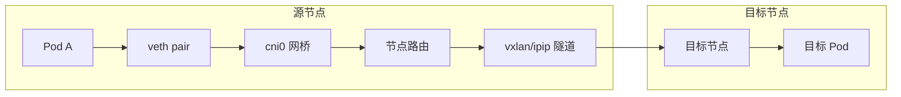

# [K8S](https://k8s.easydoc.net/docs/dRiQjyTY/28366845/6GiNOzyZ/9EX8Cp45)

## [架构](https://www.bilibili.com/video/BV1Du4m137pK/?spm_id_from=333.337.search-card.all.click&vd_source=df3f387e6c768f522e21a2778ef9dc08)


[一文讲明白K8S各核心架构组件](https://www.cnblogs.com/ZhuChangwu/p/16441181.html)

## [安装部署教程](https://www.cnblogs.com/smx886/p/18149775)

Ai提示词

```sh
centos7
192.168.120.200 为管理节点
192.168.120.201	为工作节点
192.168.120.202 为工作节点
你是一名运维工程师，现有三台2核2G的服务器，给出部署K8s教程，快速掌握K8s常用组件。使用阿里云镜像源。临时禁用 GPG 检查（仅用于测试环境）
执行kubeadm init  K8S版本号使用V1.28.0  containerd
```

### 前置准备

```sh
部署步骤
1. 基础环境准备（所有节点执行）

# 关闭防火墙
systemctl stop firewalld
systemctl disable firewalld

# 关闭swap
swapoff -a
sed -i '/swap/s/^.*/#&/' /etc/fstab

# 修改主机名
hostnamectl set-hostname k8s-master  # 在192.168.120.200执行
hostnamectl set-hostname k8s-node1   # 在192.168.120.201执行
hostnamectl set-hostname k8s-node2   # 在192.168.120.202执行

# 配置hosts文件
cat <<EOF >> /etc/hosts
192.168.120.200 k8s-master
192.168.120.201 k8s-node1
192.168.120.202 k8s-node2
EOF
```

###  安装容器运行时（所有节点执行）

```sh
配置YUM源并安装
使用阿里云镜像源安装Containerd。

# 安装基础工具
yum install -y yum-utils device-mapper-persistent-data lvm2
# 添加Docker CE仓库（包含containerd）
yum-config-manager --add-repo http://mirrors.aliyun.com/docker-ce/linux/centos/docker-ce.repo
# 安装containerd
yum install -y containerd.io
配置Containerd
生成默认配置并修改关键参数，特别是配置systemd_cgroup为true，并指定pause镜像使用阿里云源。

containerd config default | sudo tee /etc/containerd/config.toml
# 修改config.toml文件
sed -i 's/SystemdCgroup = false/SystemdCgroup = true/' /etc/containerd/config.toml
sed -i 's|k8s.gcr.io/pause|registry.aliyuncs.com/google_containers/pause|g' /etc/containerd/config.toml
sed -i 's|registry.k8s.io/pause|registry.aliyuncs.com/google_containers/pause|g' /etc/containerd/config.toml
启动并设置开机自启

systemctl daemon-reload
systemctl enable containerd
systemctl start containerd
```

### 配置Kubernetes国内源（所有节点执行）

```shell
配置Kubernetes的YUM源（阿里云新版）
创建Kubernetes的repo文件，注意这里按需临时禁用GPG检查（测试环境）。

cat <<EOF > /etc/yum.repos.d/kubernetes.repo
[kubernetes]
name=Kubernetes
baseurl=https://mirrors.aliyun.com/kubernetes-new/core/stable/v1.28/rpm/
enabled=1
# 临时禁用GPG检查
gpgcheck=0  
EOF
安装kubelet、kubeadm、kubectl

yum install -y kubelet-1.28.0-0 kubeadm-1.28.0-0 kubectl-1.28.0-0
yum install -y kubelet-1.28.15 kubeadm-1.28.15 kubectl-1.28.15 --disableexcludes=kubernetes
systemctl enable kubelet
```

### kubeadm init

```sh
kubeadm reset --force

kubeadm init \
  --kubernetes-version=v1.28.0 \
  --image-repository=registry.aliyuncs.com/google_containers \
  --apiserver-advertise-address=192.168.120.200 \
  --pod-network-cidr=10.244.0.0/16 \
  --ignore-preflight-errors=Swap  # 如果已关闭swap，此参数可省略
```

- 按提示操作配置认证

```bash
mkdir -p $HOME/.kube
sudo cp -i /etc/kubernetes/admin.conf $HOME/.kube/config
sudo chown $(id -u):$(id -g) $HOME/.kube/config
export KUBECONFIG=/etc/kubernetes/admin.conf
```

- 加入集群token过期或者遗忘，获取加入集群命令

```bash
kubeadm token create --print-join-command
```

### [安装calico网络插件](https://blog.csdn.net/qq_27610647/article/details/145457183)

```sh
kubectl apply -f calico.yaml
```

### kubeadm join

加入集群

```
kubeadm join 192.168.120.200:6443 --token faw6ej.uihz1l6gi6qc2qao --discovery-token-ca-cert-hash sha256:8419cfbf71af57094a180300861ee512b5788166d063c7778e707f06974a86da
```

### 安装问题收集

**Yum 无法验证 Kubernetes 仓库元数据的 GPG 签名**，通常是因为 **GPG 密钥不匹配或已过期**。

```sh
https://mirrors.aliyun.com/kubernetes/yum/repos/kubernetes-el7-x86_64/repodata/repomd.xml: [Errno -1] repomd.xml signature could not be verified for kubernetes

✅ 解决方案
🔧 方法一：重新导入 Kubernetes 的 GPG 密钥（推荐）
这是最常见的解决方式。阿里云镜像有时与上游 GPG 密钥不同步，需要手动重新导入。

# 1. 删除旧的 Kubernetes 仓库 GPG 密钥
rpm --import --replacepkgs https://mirrors.aliyun.com/kubernetes/yum/doc/rpm-package-key.gpg

# 或者先删除再导入
rpm -e gpg-pubkey-$(rpm -qa gpg-pubkey* | grep -o "gpg-pubkey-[a-z0-9]*" | cut -d'-' -f3- | grep -i "$(grep -A1 "
$$
kubernetes
$$
" /etc/yum.repos.d/kubernetes.repo | grep gpgkey | cut -d'/' -f7 | cut -d':' -f1)")

# 重新导入
rpm --import https://mirrors.aliyun.com/kubernetes/yum/doc/rpm-package-key.gpg
⚠️ 如果提示密钥已存在，使用 --replacepkgs 强制替换。

🔧 方法二：临时禁用 GPG 检查（仅用于测试环境）
如果您只是想快速部署测试环境，可以临时关闭 GPG 检查：


# 安装时跳过 GPG 验证
yum install -y kubelet kubeadm kubectl --disableexcludes=kubernetes --nogpgcheck
```

#### 已有集群，重新加入集群

**在控制节点上， 生成新的 token 并输出完整的加入命令** kubeadm token create --print-join-command

```sh
# 1. 在 k8s-node02 上执行完整清理
sudo kubeadm reset -f
sudo rm -rf /etc/kubernetes /var/lib/etcd /var/lib/kubelet $HOME/.kube
sudo rm -rf /etc/cni/net.d

# 2. 清理网络接口（如果有的话）
sudo ip link delete cni0
sudo ip link delete flannel.1

# 3. 重启节点（可选但推荐）
sudo reboot

# 4. 重新加入集群
sudo kubeadm join 192.168.120.200:6443 --token urujkf.2rgeylm4n4xc091h \
        --discovery-token-ca-cert-hash sha256:933f50a813c9da6ffa89f9094361356cfafc41a286091a9b309ad153953f6486
```

#### 所有节点都是 `NotReady`

所有节点都是 `NotReady` 状态，这通常是因为**网络插件（CNI）没有安装**。Kubernetes 集群需要网络插件来实现 Pod 之间的通信。

#### [k8s中 docker和containerd 镜像相互导入导出](https://blog.csdn.net/xiaogg3678/article/details/139830292)

🛠️ 镜像导入步骤

1. **从Docker导出镜像**
   在能访问Docker的机器上，使用`docker save`命令将镜像导出为`.tar`文件：

   ```
   docker save -o /path/to/your-image.tar your-image:tag
   ```

   将`your-image:tag`替换为你的实际镜像名和标签。

2. **传输镜像文件**
   将上一步生成的`.tar`文件传输到你的Kubernetes节点服务器上。你可以使用`scp`等工具：

   ```
   scp /path/to/your-image.tar user@k8s-node:/path/to/target/
   ```

3. **导入镜像到Containerd**
   在Kubernetes节点上，将镜像导入到Containerd。**请注意，Kubernetes默认使用`k8s.io`命名空间**。

   - **使用`ctr`命令导入**：

     ```
     ctr -n=k8s.io images import your-image.tar
     ```

     **注意**：`ctr`是Containerd自带的客户端工具，但请注意，它被标注为"不受支持"，其命令和选项可能在不同版本间发生变化。

   - **关于`crictl`命令**：
     `crictl`是Kubernetes社区推荐的用于调试的CRI兼容客户端。根据搜索结果，**`crictl`可能不支持直接通过`crictl pull`或`crictl images import`命令从本地tar文件导入镜像**。虽然有资料提及`crictl pull`可用于导入，但更多资料和实践表明，使用`ctr`导入到`k8s.io`命名空间是可靠方法。镜像导入后，`crictl`可以查看和管理。

4. **验证镜像**
   导入后，**强烈建议**你验证镜像是否在`k8s.io`命名空间中可用。

   - 使用`crictl`检查（推荐，因其更贴近Kubernetes环境）：

     ```
     crictl images | grep "your-image"
     ```

   - 使用`ctr`在`k8s.io`命名空间中检查：

     ```
     ctr -n=k8s.io images list | grep "your-image"
     ```

## 镜像仓库 registry

------

### 三、编写 docker-compose.yml

创建 `docker-compose.yml` 文件：

```
version: '3.8'

services:
  registry:
    image: registry:2
    container_name: registry
    restart: always
    ports:
      - "5000:5000"
    environment:
      REGISTRY_STORAGE_DELETE_ENABLED: "true"
    volumes:
      - ./data:/var/lib/registry
```

------

### 四、验证服务

```
访问测试：
http://服务器IP:5000/v2/
如果返回：{} 说明启动成功。

```

### 测试推送镜像

#### 1️⃣ 修改 Docker 配置（如果是 HTTP）

```
vi /etc/docker/daemon.json
```

加入：

```
{
  "insecure-registries": ["服务器IP:5000"]
}
```

重启 Docker：

```
systemctl restart docker
```

------

#### 2️⃣ 打 tag 并 push

```
docker pull nginx
docker tag nginx 服务器IP:5000/nginx
docker push 服务器IP:5000/nginx
```


## Docker 迁移上K8s

### 🧩 一、环境说明与前提条件

假设：

- Docker 离线镜像包：`app1.tar`, `app2.tar`, ...
- 对应 compose 文件：`app1.yml`, `app2.yml`, ...
- Kubernetes 使用 containerd
- 已安装 `crictl`（配置好 `/etc/crictl.yaml`）
- 目标：把这些镜像导入 containerd，并把 docker-compose 转为 Kubernetes YAML 部署。

------

### 🪣 二、导入镜像到 containerd

在 containerd 环境中，`docker load` 不可用，你需要使用 `crictl` 或 `ctr`。

#### ✅ 方法1：使用 `crictl` 导入

```
sudo crictl images   # 查看现有镜像
sudo crictl load app1.tar
sudo crictl load app2.tar
```

输出类似：

```
Loaded image: docker.io/library/nginx:latest
```

> **提示：** `crictl load` 实际底层调用的是 containerd 的 `ctr images import`，效果等同。

------

#### ✅ 方法2：使用 `ctr` 导入（可选）

```
sudo ctr -n k8s.io images import app1.tar
sudo ctr -n k8s.io images ls
```

------

### 🧾 三、从 docker-compose.yml 转换成 Kubernetes YAML

每个 `.yml` 对应一个 Docker Compose 应用。
 可以通过工具 **`kompose`** 自动转换。

#### 安装 kompose

```
sudo curl -L https://github.com/kubernetes/kompose/releases/latest/download/kompose-linux-amd64 -o /usr/local/bin/kompose

网络原因离线部署、安装到系统 PATH
sudo mv /data/kompose /usr/local/bin/kompose
sudo chmod +x /usr/local/bin/kompose


```

#### 转换命令

以 `app1.yml` 为例：

```
kompose convert -f app1.yml -o app1-k8s.yaml
```

生成的文件会包含：

- Deployment
- Service
- 可能还有 PersistentVolumeClaim (如果 compose 中定义了 volumes)

你可以对多个 yml 批量转换：

```
for file in *.yml; do
    base=$(basename $file .yml)
    kompose convert -f $file -o ${base}-k8s.yaml
done
```

------

### 🚀 四、在 Kubernetes 中部署

确认镜像已经导入后（可通过 `crictl images` 查看），
 再执行：

```
kubectl apply -f app1-k8s.yaml
kubectl apply -f app2-k8s.yaml
```


## Pod

### 资源管理


### 调度策略

- **动调度：**运行在哪个节点上完全由Scheduler经过一系列的算法计算得出
- **定向调度(针对Pod)：**NodeName、NodeSelector
- **亲和性调度(针对Pod)：**NodeAffinity、PodAffinity、PodAntiAffinity
- **污点(针对Node) / 容忍(针对Pod)调度：**Node Taints、Pod Toleration

### [探针](https://www.cnblogs.com/huangSir-devops/p/18905316)

Kubernetes (k8s) 探针是保障`应用在容器中稳定运行`的重要机制。下面这个表格能帮你快速理解三种探针的核心区别：

| 探针类型                       | 核心作用                               | 探测失败后果                                                | 典型应用场景                                                 |
| :----------------------------- | :------------------------------------- | :---------------------------------------------------------- | :----------------------------------------------------------- |
| **启动探针** (Startup Probe)   | 判断应用**是否已成功启动**。           | Kubernetes会重启容器（Pod）。                               | 应用启动过程漫长（如Java应用），需要避免在启动期间被存活探针误杀。 |
| **存活探针** (Liveness Probe)  | 判断容器**是否仍在健康运行**。         | Kubernetes会重启容器（Pod）。                               | 检测应用是否陷入死锁、死循环等不健康状态。                   |
| **就绪探针** (Readiness Probe) | 判断容器**是否已准备好接收外部流量**。 | 从**Service的负载均衡**中**移除**该容器，暂时**切断流量**。 | 应用已启动但需要完成大量数据加载或配置预热，暂时无法处理请求 |

###  Pod核心运维命令速查

下表汇总了Pod日常运维中最常用的命令，你可以根据需要灵活选用。

| **应用场景**     | **常用命令示例**                                             | **作用说明**                                        |
| :--------------- | :----------------------------------------------------------- | :-------------------------------------------------- |
| **📊 状态查看**   | `kubectl get pods -n <namespace>`                            | 查看Pod列表                                         |
|                  | `kubectl get pods -o wide -n <namespace>`                    | 查看Pod列表及更详细信息（如IP和节点）               |
|                  | `kubectl get pods -w -n <namespace>`                         | 实时监控Pod状态变化                                 |
| **🔎 信息排查**   | `kubectl describe pod <pod-name> -n <namespace>`             | 查看Pod详细配置和**事件（Events）**，常用于排查故障 |
|                  | `kubectl logs <pod-name> -n <namespace>`                     | 查看Pod日志                                         |
|                  | `kubectl logs -f --tail=100 <pod-name> -n <namespace>`       | 实时查看最新的100行日志                             |
| **🔧 容器操作**   | `kubectl exec -it <pod-name> -n <namespace> -- /bin/sh`      | 进入Pod的容器                                       |
|                  | `kubectl exec -it <pod-name> -c <container-name> -n <namespace> -- /bin/bash` | 进入Pod内**指定容器**（适用于多容器Pod）            |
|                  | `kubectl cp <pod-name>:<file-path> <local-path> -n <namespace>` | 从Pod复制文件到本地                                 |
|                  | `kubectl cp <local-path> <pod-name>:<pod-path> -n <namespace>` | 从本地复制文件到Pod                                 |
| **🛠️ 调试与维护** | `kubectl port-forward <pod-name> <local-port>:<pod-port> -n <namespace>` | 将Pod端口映射到本地，方便调试                       |
|                  | `kubectl delete pod <pod-name> -n <namespace>`               | 删除Pod                                             |

### 🚀 实用操作技巧与排查思路

除了单条命令，将这些命令组合运用能解决更复杂的问题。

- **快速创建一个测试Pod**
  当你需要一个干净的环境测试命令或调试网络时，可以快速创建一个临时Pod：

  ```
  kubectl run debug-pod --image=busybox:1.35 -it --rm --restart=Never -- /bin/sh
  ```
  
  `--rm` 选项表示退出后自动删除Pod，`--restart=Never` 确保它不会自动重启。这对于临时任务非常方便。

- **组合命令排查Pod启动失败**
  当一个Pod状态一直不是 `Running` 时，可以按照以下流程排查：

  1. **查看详细事件**：`kubectl describe pod <pod-name>`。重点关注 **Events** 部分，这里通常会直接显示错误原因，例如镜像拉取失败、资源不足等。
  2. **查看实时日志**：如果Pod曾经启动过，可以用 `kubectl logs -f <pod-name>` 来查看实时日志，定位应用自身的启动错误。

- **掌握与Pod相关的控制器**
  在实际使用中，Pod通常由Deployment、StatefulSet等控制器管理。理解这一点很重要，因为直接删除由控制器管理的Pod，控制器会立即重建一个新的。

  - 查看Deployment：`kubectl get deployments -n <namespace>`
  - 重启Deployment下的所有Pod（滚动重启）：`kubectl rollout restart deployment/<deployment-name> -n <namespace>`
  - 调整Pod副本数：`kubectl scale deployment/<deployment-name> --replicas=2 -n <namespace>`

### 批量停止命名空间下的pod

```shell
#副本数设置为0
for deploy in $(kubectl get deployments -n ry -o name); do
    kubectl scale $deploy --replicas 0 -n ry
done
```

## Deployment

Kubernetes Deployment 是你管理应用部署和更新的关键资源。下面这个表格汇总了 Deploymen t的常用命令，方便你快速掌握核心操作：

| 操作类别            | 常用命令示例                                                 | 功能说明                                     |
| :------------------ | :----------------------------------------------------------- | :------------------------------------------- |
| **创建 Deployment** | `kubectl create deployment <名称> --image=<镜像> --replicas=<副本数>` | 通过命令行快速创建 Deployment。              |
|                     | `kubectl apply -f deployment.yaml`                           | 通过 YAML 配置文件创建或更新 Deployment。    |
| **查看与检查**      | `kubectl get deployments`                                    | 列出所有 Deployment 的基本状态。             |
|                     | `kubectl describe deployment <deployment-name>`              | 显示指定 Deployment 的详细配置和状态。       |
|                     | `kubectl get pods -l app=<应用标签>`                         | 根据标签查看 Deployment 创建的 Pod。         |
| **更新与回滚**      | `kubectl set image deployment/<名称> <容器名>=<新镜像>`      | 更新 Deployment 的容器镜像（触发滚动更新）。 |
|                     | `kubectl rollout status deployment/<名称>`                   | 实时观察滚动更新的状态。                     |
|                     | `kubectl rollout undo deployment/<名称>`                     | 将 Deployment 回滚到上一个版本。             |
| **扩缩容**          | `kubectl scale deployment <名称> --replicas=<新副本数>`      | 增加或减少 Pod 的副本数量，以应对负载变化。  |
| **删除资源**        | `kubectl delete deployment <名称>`                           | 删除指定的 Deployment。                      |
|                     | `kubectl delete -f deployment.yaml`                          | 通过配置文件删除 Deployment。                |

### 💡 高效管理技巧

除了上述基本命令，掌握下面几个技巧能让你的日常运维工作更高效：

- **📝 声明式配置与管理**：
  建议你优先使用 `kubectl apply -f deployment.yaml` 这种方式来管理应用。这种方式将你的部署状态记录在了 YAML 文件中，易于版本控制和重复部署，是实现 GitOps 的基础。
- **🔄 掌握滚动更新与回滚**：
  当你修改 Deployment 的配置（例如镜像版本）并执行 `kubectl apply` 后，Kubernetes 默认会启动**滚动更新**。你可以通过 `kubectl rollout status` 命令来实时查看更新的进度。如果新版本出现问题，使用 `kubectl rollout undo` 命令可以快速回滚到上一个版本。
- **🔧 配置健康检查**：
  为了确保你的应用高可用，强烈建议在 Deployment 的 YAML 文件中配置**存活探针 (livenessProbe)** 和 **就绪探针 (readinessProbe)**。这样 Kubernetes 能够自动判断容器的健康状态，并在应用异常时自动重启或将其从服务端点中移除，从而保障业务连续性。
- **🔍 善用资源监控**：
  你可以使用 `kubectl get pods` 命令来查看 Pod 的运行状态。如果某个 Pod 状态异常，可以进一步使用 `kubectl logs <pod-name>` 查看其日志，或者使用 `kubectl describe pod <pod-name>` 命令来获取更详细的事件信息，这对于排查故障非常有帮助。

### 💎 总结

简单来说，掌握 Kubernetes Deployment 的核心就在于用好“**增删改查，伸缩滚回**”这八个字。熟练运用上述命令和技巧，你就能从容地管理 Kubernetes 上的应用部署了。

## Service

Kubernetes Service 是你暴露应用服务、实现服务发现和负载均衡的核心资源。下面这个表格汇总了 Service 的常用命令，帮你快速掌握核心操作：

### 📋 Service 核心命令速查表

| 操作类别         | 常用命令示例                                                 | 功能说明                             |
| :--------------- | :----------------------------------------------------------- | :----------------------------------- |
| **创建 Service** | `kubectl expose deployment <deployment名> --port=端口 --target-port=目标端口 --type=类型` | 基于已有 Deployment 创建 Service     |
|                  | `kubectl apply -f service.yaml`                              | 通过 YAML 配置文件创建或更新 Service |
| **查看与检查**   | `kubectl get services` 或 `kubectl get svc`                  | 列出所有 Service 的基本信息          |
|                  | `kubectl describe service <service名>`                       | 显示指定 Service 的详细配置和状态    |
|                  | `kubectl get endpoints <service名>`                          | 查看 Service 的后端端点（Pod IP）    |
| **更新与维护**   | `kubectl edit service <service名>`                           | 直接编辑运行中的 Service 配置        |
|                  | `kubectl patch service <service名> -p '{"spec": {...}}'`     | 部分更新 Service 配置                |
| **删除 Service** | `kubectl delete service <service名>`                         | 删除指定的 Service                   |
|                  | `kubectl delete -f service.yaml`                             | 通过配置文件删除 Service             |

### 🔧 Service 类型与使用场景

1. **ClusterIP（默认）**

```
# 创建 ClusterIP Service（集群内部访问）
kubectl expose deployment nginx --port=80 --target-port=80 --name=nginx-service
# --port 表示服务要开放的端口
# --target-port 表示容器里当时绑定的端口
```

2. **NodePort**

```
# 创建 NodePort Service（节点端口访问）
kubectl expose deployment nginx --port=80 --target-port=80 --type=NodePort --name=nginx-nodeport
```

3. [**LoadBalancer**](https://www.cnblogs.com/hahaha111122222/p/17222831.html) 

   > [!NOTE]
   >
   > 指定ip范围

```
# 创建 LoadBalancer Service（云提供商负载均衡器）
kubectl expose deployment nginx --port=80 --target-port=80 --type=LoadBalancer --name=nginx-lb
```

### 🛠️ 实用运维技巧

#### **1. 服务发现与测试**

```
# 在集群内部测试 Service 连通性
kubectl run test-pod --image=busybox --rm -it -- sh
# 进入容器后测试：wget -O- <service名>:<端口>

# 查看 Service 的 DNS 解析
kubectl get service # 获取 Service ClusterIP
nslookup <service-name>.<namespace>.svc.cluster.local
```

#### **2. 标签选择器验证**

```
# 查看 Service 选择的 Pod
kubectl get pods -l app=nginx

# 验证 Service 的 selector
kubectl describe service <service名> | grep Selector
```

#### **3. 端口转发（临时外部访问）**

```
# 将本地端口转发到 Service
kubectl port-forward service/<service名> 8080:80

# 将本地端口转发到特定 Pod
kubectl port-forward pod/<pod名> 8080:80
```

### 📝 Service YAML 配置示例

```
apiVersion: v1
kind: Service
metadata:
  name: my-service
spec:
  selector:
    app: nginx
  ports:
    - name: http
      port: 80
      targetPort: 80
      protocol: TCP
  type: ClusterIP
```

### 🔍 故障排查命令

```
# 检查 Service 端点是否正常
kubectl get endpoints <service名>

# 查看 Service 相关事件
kubectl describe service <service名>

# 检查 Pod 标签是否匹配 Service selector
kubectl get pods --show-labels

# 测试 Service 网络连通性
kubectl run network-test --image=nicolaka/netshoot -it --rm -- /bin/bash
# 在测试容器中执行：curl http://<service名>:<端口>
```

### 💡 最佳实践建议

1. **📝 声明式配置**：始终使用 YAML 文件管理 Service，便于版本控制和重复部署
2. **🏷️ 清晰的标签管理**：确保 Service selector 与 Pod 标签精确匹配
3. **🔒 最小权限原则**：根据访问需求选择合适的 Service 类型
   - 集群内部访问：ClusterIP
   - 节点级别外部访问：NodePort
   - 云环境外部访问：LoadBalancer
4. **🌐 Ingress 补充**：对于 HTTP/HTTPS 服务，结合 Ingress 提供更灵活的路由能力

### 💎 总结

掌握 Kubernetes Service 的核心在于理解**服务发现**和**流量负载均衡**。记住这几个关键点：

- **服务发现**：Pod 可以通过 Service 名称进行通信，无需关注 Pod IP 变化
- **负载均衡**：Service 自动将流量分发到后端所有健康 Pod
- **访问控制**：通过不同类型的 Service 控制服务的暴露范围

### 修改 k8s nodePort 可以暴露的端口范围

我们使用的是 kubeadm 安装的集群，API 服务器的配置通常在 /etc/kubernetes/manifests/kube-apiserver.yaml 文件中。

```
   - --service-node-port-range=1000-40000
```


由于 kubelet 会对目录进行监视以查看是否有改动，因此不需要再做其他操作。kubelet 将使用新的配置重新创建 kube-apiserver。

### [安装 MetalLB LoadBalancer](https://www.lixueduan.com/posts/cloudnative/01-metallb/)

创建资源：

```shell
kubectl apply -f https://raw.githubusercontent.com/metallb/metallb/v0.13.12/config/manifests/metallb-native.yaml
```

查看资源：

```shell
kubectl get pod -n metallb-system

[root@k8s-master k8s-config]# kubectl get pod -n metallb-system
NAME                         READY   STATUS    RESTARTS      AGE
controller-75c75cc7f-skj8x   1/1     Running   0             5m28s
speaker-48f92                1/1     Running   0             19m
speaker-56xdb                1/1     Running   0             19m
speaker-82sxf                1/1     Running   2 (20m ago)   10h
```

设置 ip 地址池，创建配置 ip 地址池的 yml 文件：

```shell
mkdir -p /ry/k8s-config
touch /ry/k8s-config/metallb-ip-pool-config.yml

apiVersion: metallb.io/v1beta1
kind: IPAddressPool
metadata:
  name: first-pool
  namespace: metallb-system
spec:
  addresses:
  # 局域网，ip 要在同一网段，和虚拟机所在的网段一致
  - 192.168.120.240-192.168.120.250

---
apiVersion: metallb.io/v1beta1
kind: L2Advertisement
metadata:
  name: example
  namespace: metallb-system
spec:
  ipAddressPools:
  - first-pool

```

生效这个 yaml 配置文件：

```shell
kubectl apply -f metallb-ip-pool-config.yml

```

可以编写一个资源清单，将 Nginx 的端口暴露到 `192.168.10.240` 的 80 端口：

```shell
apiVersion: apps/v1
kind: Deployment
metadata:
  name: nginx-deploy
  namespace: ry
spec:
  replicas: 2
  selector:
    matchLabels:
      app: nginx
  template:
    metadata:
      labels:
        app: nginx
    spec:
      containers:
      - name: nginx
        image: nginx:latest
        resources:
          limits:
            memory: "512Mi"
            cpu: "500m"
        ports:
        - containerPort: 80
          name: http

---
apiVersion: v1
kind: Service
metadata:
  name: nginx
  namespace: ry
spec:
  type: LoadBalancer
  selector:
    app: nginx
  ports:
  - name: http
    port: 80
    protocol: TCP
    targetPort: 80
  # 指定的负载均衡 IP
  loadBalancerIP: 192.168.120.240

kubectl apply -f metallb-nginx-example.yml

```

#### 验证MetalLB是否生效

```shell
kubectl get svc -n test
NAME    TYPE           CLUSTER-IP       EXTERNAL-IP       PORT(S)       AGE
nginx   LoadBalancer   10.102.234.110   192.168.120.240   80:1223/TCP   10h
```

访问 `http://192.168.120.240/` 就可以看到 Nginx 的页面了。

## YAML

✅ **Deployment + Service YAML 示例（逐行注释）**

```
apiVersion: apps/v1          # 使用的 API 版本，Deployment 资源属于 apps/v1
kind: Deployment             # 声明这是一个 Deployment（部署控制器）
metadata:                    # 元数据定义
  name: nginx-deployment     # Deployment 名称
  labels:                    # 给资源打标签
    app: nginx               # 标签键值对，用于选择器或分类
spec:                        # Deployment 规范定义
  replicas: 3                # 副本数量，期望运行的 Pod 数
  selector:                  # Pod 选择器，与 Pod 的标签必须匹配
    matchLabels:             # 匹配指定的标签
      app: nginx             # 匹配 app=nginx 的 Pod
  template:                  # Pod 模板，定义如何创建 Pod
    metadata:                # Pod 的元数据
      labels:                # 给 Pod 设置标签
        app: nginx           # Pod 标签必须与 selector 一致
    spec:                    # Pod 内容定义
      containers:            # 容器列表（一个 Pod 可包含多个容器）
      - name: nginx          # 容器名称
        image: nginx:1.21    # 使用的镜像及版本
        ports:               # 容器要暴露的端口
        - containerPort: 80  # 容器监听的端口号
```

------

✅ **Service 示例（逐行注释）**

```
apiVersion: v1               # Service 使用的 API 版本为 v1
kind: Service                # 声明资源类型为 Service
metadata:                    # Service 的元数据
  name: nginx-service        # Service 名称
spec:                        # Service 的配置
  selector:                  # 匹配 Pod，决定将流量导向哪些 Pod
    app: nginx               # 匹配标签 app=nginx 的 Pod
  ports:                     # Service 暴露的端口配置
  - protocol: TCP            # 使用的协议（通常是 TCP）
    port: 80                 # Service 暴露的端口
    targetPort: 80           # 后端容器监听的端口（通常与 containerPort 相同）
  type: ClusterIP            # Service 类型（默认 ClusterIP，集群内访问）
```

### 总结笔记要点

- **`apiVersion`, `kind`, `metadata`**： 是所有 K8s 资源的“头”，用于声明资源和标识它。
- **`spec`**： 是资源的“心脏”，描述了你的**期望状态**。
- **`selector`**： 是连接资源的“桥梁”。Deployment 用它管理 Pod，Service 用它找到 Pod。
- **`labels`**： 是资源的“名片”，用于标识、分类和选择资源。
- **`template`**： 在 Deployment 中，它是 Pod 的“模具”，定义了要创建的 Pod 长什么样。
- **`ports`**： 注意区分 `port`（Service 端口）、`targetPort`（容器端口）和 `nodePort`（节点端口）。
- **探针 (Probes)**： `livenessProbe`（存活探针）保证应用健康运行，`readinessProbe`（就绪探针）保证流量只发给准备好的 Pod。


## Ingress

Ingress 是暴露 Kubernetes Service（通常是 HTTP/HTTPS）的统一入口。它通过 **反向代理 / 7 层负载均衡 / 路由** 将外部流量按照规则转发到集群内部服务。


### 从外部域名访问到最终Pod的完整链路和原理

**域名解析 → 到达入口（Ingress Controller）→ 负载均衡（Service）→ 最终容器（Pod）**。

| 组件                   | 工作层      | 关键作用                                                     | 类比                                                         |
| :--------------------- | :---------- | :----------------------------------------------------------- | :----------------------------------------------------------- |
| **Ingress Controller** | 应用层 (L7) | **HTTP/HTTPS路由器**。根据域名、路径等规则，将外部请求分发给内部不同的Service。 | **公司的前台/总机**。你报出要找的人名（域名），它帮你转接到对应的部门分机（Service）。 |
| **Service**            | 传输层 (L4) | **内部负载均衡器**。提供稳定的访问端点，并将流量以TCP/UDP形式负载到后端Pod。 | **部门的分机号**。无论部门内谁在值班（Pod IP），你打这个分机号（Service IP）总能找到人，并且会被自动转给一个空闲的员工。 |
| **Pod**                | -           | **实际工作者**。运行应用代码，处理具体业务请求。             | **部门的员工**。真正处理具体事务的人。                       |

### 部署

```shell
kubectl apply -f ingressDeploy.yaml
```

#### Ingress-HTTP

```shell
kubectl apply -f deploy-svc-nginx.yaml
kubectl apply -f deploy-svc-tomcat.yaml
kubectl apply -f ingress-nginx-tomcat.yaml
```

#### 域名访问

修改ingress-nginx.yaml文件

```
423行左右的位置，添加 hostNetwork: true。
hostNetwork： true的补充说明:
此参数为true表示pod使用主机网络，也就是pod的IP就是node的IP
若不添加，后续使用 域名:nodeport 访问；
添加之后，直接使用域名访问。

kubectl apply -f ingress-nginx.yaml
```

#### 暴露方式改为NodePort

```
kubectl -n ingress-nginx get svc
NAME                                 TYPE           CLUSTER-IP      EXTERNAL-IP   PORT(S)                      AGE
ingress-nginx-controller             LoadBalancer   10.97.247.188   <pending>     80:32139/TCP,443:30230/TCP   2m21s
ingress-nginx-controller-admission   ClusterIP      10.102.148.38   <none>        443/TCP                      2m21s
```

 **第 1 步：修改 ingress-nginx-controller Service 类型为 NodePort**

```
kubectl -n ingress-nginx edit svc ingress-nginx-controller
把其中的：type: LoadBalancer
改成：type: NodePort
```

**第 2 步：查看 NodePort 端口**

```
kubectl -n ingress-nginx get svc ingress-nginx-controller
```

配置host文件

> [!NOTE]
>
> 注意ip与域名的映射关系


###  **Ingress 的核心组件**

#### ✔️ Ingress 资源（Ingress Resource）

定义路由规则，例如：

- 主机名（host）路由
- 路径（path）转发
- TLS 配置

 1. 依据 Host（域名）路由

```shell
spec:
  rules:
  - host: "api.example.com"
    http:
      paths:
      - path: /
        backend:
          service:
            name: api-svc
            port:
              number: 80
```

🟩 2. 依据 Path（路径）路由

```sh
/spec:
  rules:
  - host: "example.com"
    http:
      paths:
      - path: /user
        pathType: Prefix
        backend:
          service:
            name: user-svc
      - path: /order
        pathType: Prefix
        backend:
          service:
            name: order-svc
```

🟧 pathType 有三类

| pathType                   | 含义                   |
| -------------------------- | ---------------------- |
| **Prefix**                 | 前缀匹配（推荐）       |
| **Exact**                  | 精确匹配               |
| **ImplementationSpecific** | 控制器自定义（不推荐） |

#### ✔️ Ingress 控制器（Ingress Controller）

负责解析 Ingress 资源并实际执行路由与负载均衡功能。

| Controller                   | 特点             |
| ---------------------------- | ---------------- |
| **Nginx Ingress Controller** | 最常用，成熟稳定 |

## Volume

**核心思想：为什么需要 PV 和 PVC？**          为了**解耦**。

- **问题**：Pod 是临时的、可漂移的，但数据需要是持久的。如果直接在 Pod 定义里写 `hostPath: /data`，那么 Pod 就只能运行在拥有 `/data` 目录的特定节点上，失去了编排的灵活性。
- **解决方案**：K8s 引入了 **PV（持久卷）** 和 **PVC（持久卷声明）** 两层抽象。
  - **管理员**：负责创建**PV**（就像准备一个实际的硬盘/云盘）。
  - **开发者**：负责创建**PVC**（就像提交一个申请单，写明需要多大的硬盘、什么性能）。
  - **Pod**：通过 `volumeMounts` 引用 **PVC**，而无需关心背后的 PV 具体是什么、在哪里。

### Local PV解耦

> 学到Local PV 时都会问：既然不能跨节点，那我为什么不直接在 Deployment 里用 hostPath

调度安全性（最重要）

hostPath 没有 nodeAffinity

如果你 Deployment 没写 nodeSelector：

Pod 可能被调度到：

- 192.168.120.201
- 192.168.120.202

但 `/pv/ry-cloud/nacos/data`：

- 只存在于某一台机器
- 其他节点可能是空目录

结果：

- 数据丢失
- 目录被自动创建
- 或直接挂载异常

------

Local PV 会强制绑定节点

你写了：

```
nodeAffinity:
  required:
    nodeSelectorTerms:
```

调度器会保证：

> 使用这个 PVC 的 Pod 必须调度到 k8s-master

这叫：`存储驱动调度`

 存储与应用解耦

hostPath 的问题：

> 存储写死在 Deployment 里

Local PV 模式：

- PV 由运维创建
- 应用只申请 PVC
- 不关心底层是本地盘还是 NFS

这符合 Kubernetes 设计哲学：

👉 应用不关心存储实现

### **核心概念解析**

- **定义**：Pod 中可以被多个容器访问的共享目录。
- **生命周期**：与 Pod **绑定**。Pod 被删除，对应的 Volume 也可能被清理（取决于类型，如 `emptyDir` 会消失，但 `nfs` 不会）。
- **常见类型**：
  - `emptyDir`： 临时空目录，随 Pod 创建而创建，删除而消失。用于容器间临时共享数据。
  - `hostPath`： 将节点上的文件或目录挂载到 Pod 中。**仅用于单节点测试或系统级 Pod（如 CNI 插件），不适合生产数据库**。

#### **PersistentVolume (PV) - 持久卷**

- **定义**：**集群级别的资源**，代表一块**实际的、可用的网络存储**。由管理员预先创建或由 StorageClass 动态创建。
- **生命周期**：独立于 Pod。Pod 删除后，PV 依然存在，数据得以保留。
- **关键配置**：
  - `capacity.storage`： 容量（如 10Gi）
  - `accessModes`： 访问模式
    - `ReadWriteOnce (RWO)`： 可读可写，但只能被一个节点挂载。
    - `ReadOnlyMany (ROX)`： 只读，可被多个节点挂载。
    - `ReadWriteMany (RWX)`： 可读可写，可被多个节点挂载。
  - `persistentVolumeReclaimPolicy`： 回收策略
    - `Retain`： **保留**。手动回收，数据最安全。
    - `Delete`： **删除**。删除 PVC 时，自动删除对应的后端存储（如 AWS EBS）。
    - `Recycle`： **回收**（已废弃）。基本不再使用。
  - `storageClassName`： 存储类名称，用于动态供给。

#### **PersistentVolumeClaim (PVC) - 持久卷声明**

- **定义**：**命名空间级别的资源**，代表 Pod 对存储的**请求**。
- **作用**：像一个“接口”或“申请单”，Pod 通过它来消费 PV 资源。
- **关键配置**：
  - `accessModes`： 请求的访问模式（必须与目标 PV 匹配）。
  - `resources.requests.storage`： 请求的存储容量。
  - `storageClassName`： 指定需要的存储类，这是**动态供给的关键**。

#### **StorageClass (SC) - 存储类**

- **定义**：定义了“**如何创建 PV**”的模板。它使得 PV 可以按需动态创建，无需管理员手动干预。
- **核心部件**：`provisioner` 字段，指定用于创建 PV 的卷插件（如 `kubernetes.io/aws-ebs`, `csi.trident.netapp.io`）。

------

### **工作流程与生命周期**

#### **静态供给**

管理员提前创建好一批 PV，等待用户使用。

**流程**：
`管理员创建 PV` -> `用户创建 PVC` -> `K8s 绑定 PVC 到合适的 PV` -> `用户创建 Pod 并使用 PVC`

#### **动态供给（现代标准方式）**

当没有合适的 PV 与 PVC 匹配时，K8s 集群会根据 PVC 指定的 StorageClass 自动创建 PV。

**流程**：
`管理员创建 StorageClass` -> `用户创建 PVC (指定 StorageClass)` -> `SC 的 Provisioner 自动创建 PV 并绑定到 PVC` -> `用户创建 Pod 并使用 PVC`

------

### 常用运维命令

```bash
# 查看 PV
kubectl get pv

# 查看 PVC
kubectl get pvc -n <namespace>

# 查看 StorageClass
kubectl get sc

# 查看 PV 的详细信息
kubectl describe pv <pv-name>

# 查看 PVC 的详细信息（包括与之绑定的 PV 和事件）
kubectl describe pvc <pvc-name> -n <namespace>

# 删除 PVC (如果回收策略是 Delete，会连带删除后端存储和 PV)
kubectl delete pvc <pvc-name> -n <namespace>

# 强制删除处于 Terminating 状态的 PV
kubectl patch pv <pv-name> -p '{"metadata":{"finalizers":null}}'
```

------

### **要点与排错总结**

1. **访问模式是匹配关键**：`RWO` 的 PVC 无法绑定到 `RWX` 的 PV。
2. **`storageClassName` 是匹配桥梁**：在静态供给中，PV 和 PVC 必须指定相同名字的 `storageClassName`（或都设置为 `""`）。
3. **动态供给是首选**：对于云环境，永远使用动态供给。它灵活、高效，无需人工干预。
4. **`volumeBindingMode: WaitForFirstConsumer`**：对于不支持拓扑感知的存储（如 EBS， Azure Disk），务必在 SC 中设置此模式。这能确保 PV 在 Pod 被调度的节点上创建，避免调度失败。
5. **排错思路**：
   - `kubectl describe pvc <pvc-name>` 是**最重要的命令**。查看 `Events` 部分，通常会明确告诉你绑定失败的原因（如：没有匹配的 PV、容量不足、访问模式不匹配等）。
   - PVC 一直处于 `Pending` 状态？
     - 静态供给：检查是否有匹配的 PV（容量、访问模式、`storageClassName`）。
     - 动态供给：检查 SC 是否存在、拼写是否正确、`provisioner` 是否可用。
   - Pod 一直处于 `Pending` 状态？
     - 检查 Pod 使用的 PVC 是否已成功绑定（`kubectl get pvc`）。
     - 如果 PVC 已绑定，但 Pod 无法挂载，检查节点上的 CSI 驱动是否正常安装。

### **PV/PVC、ConfigMap 和 Secret** 的详细对比

**ConfigMap 管理应用配置，Secret 管理凭证，PV/PVC 保障数据持久化**

| **特性**     | **PV/PVC**                      | **ConfigMap**                    | **Secret**                            |
| :----------- | :------------------------------ | :------------------------------- | :------------------------------------ |
| **目的**     | 管理持久化存储                  | 管理非敏感配置数据               | 管理敏感信息（如密码、密钥）          |
| **数据内容** | 存储卷（磁盘/网络存储）         | 配置文件、环境变量、命令行参数等 | 密码、Token、SSH 密钥、TLS 证书等     |
| **存储方式** | 持久化存储（如云盘、NFS、Ceph） | 存储在 etcd 中（明文）           | 存储在 etcd 中（Base64 编码，可加密） |
| **安全性**   | 依赖后端存储的安全性            | 非加密，不适合敏感信息           | 支持静态加密（K8s 集群级别）          |
| **使用方式** | Pod 通过 PVC 挂载卷             | 环境变量、配置文件卷挂载         | 环境变量、配置文件卷挂载              |

### 三者的配合使用场景

一个应用通常**同时使用三者**：

- **数据库应用**：
  - **PV/PVC**：存储数据库文件。
  - **ConfigMap**：配置 `my.cnf`（非敏感参数）。
  - **Secret**：存储 `root` 密码和复制凭据。
- **Web 应用**：
  - **ConfigMap**：配置前端环境变量（如 API 地址）。
  - **Secret**：存储数据库连接密码。
  - **PV/PVC**：存储上传的文件或日志（可选）。

### 实战

```shell
一、整体关系说明
PV（PersistentVolume）：管理员创建，代表一块真实存储
PVC（PersistentVolumeClaim）：用户申请存储
Pod：通过 PVC 使用存储

二、创建 PV（PersistentVolume）
1️⃣ pv-hostpath.yml
apiVersion: v1
kind: PersistentVolume
metadata:
  name: pv-hostpath-1
spec:
  capacity:
    storage: 1Gi
  accessModes:
    - ReadWriteOnce
  persistentVolumeReclaimPolicy: Retain
  storageClassName: manual
  hostPath:
    path: /data/pv1


📌 说明：

/data/pv1 是 Node 上的真实目录

Retain：PVC 删除后，PV 不会被自动删除

storageClassName 必须和 PVC 一致

创建：

kubectl apply -f pv-hostpath.yml


查看：

kubectl get pv

三、创建 PVC（PersistentVolumeClaim）
2️⃣ pvc-hostpath.yml
apiVersion: v1
kind: PersistentVolumeClaim
metadata:
  name: pvc-hostpath-1
spec:
  accessModes:
    - ReadWriteOnce
  resources:
    requests:
      storage: 1Gi
  storageClassName: manual


创建：

kubectl apply -f pvc-hostpath.yml


查看绑定状态：

kubectl get pvc
kubectl get pv


✅ 状态应为：

STATUS: Bound

四、Pod 使用 PVC
3️⃣ pod-use-pvc.yml
apiVersion: v1
kind: Pod
metadata:
  name: pod-pvc-test
spec:
  containers:
  - name: busybox
    image: busybox
    command: ["/bin/sh", "-c", "sleep 3600"]
    volumeMounts:
    - name: mypvc
      mountPath: /data
  volumes:
  - name: mypvc
    persistentVolumeClaim:
      claimName: pvc-hostpath-1


创建 Pod：

kubectl apply -f pod-use-pvc.yml

五、验证存储是否可用
进入 Pod
kubectl exec -it pod-pvc-test -- sh

写入数据
echo "hello k8s pv pvc" > /data/test.txt

到 Node 上验证
cat /data/pv1/test.txt


能看到内容说明 PVC → PV → 宿主机目录 已打通 ✅
```

## 网络

### K8s 网络知识详解

#### 一、Kubernetes 网络设计目标

Kubernetes 网络模型遵循四个核心原则：

1. 每个 Pod 拥有独立 IP
2. Pod 之间可以直接通信（无需 NAT）
3. Node 与 Pod 可以直接通信
4. 不依赖端口映射

这被称为 **扁平化网络模型（Flat Network Model）**。

---

#### 二、K8s 网络整体结构

Kubernetes 网络可以分为四层结构：

容器 → Pod 网络 → Node 网络 → Service 网络 → Ingress

---

#### 三、容器网络

##### 1. Pod 内部通信

- 一个 Pod 内多个容器共享：
  - 网络命名空间
  - IP 地址
  - 端口空间

- 容器之间通过 `localhost` 通信。

##### 2. 网络命名空间原理

Pod 创建时：

- 生成 pause 容器
- 创建 network namespace
- 其他容器加入该 namespace

---

#### 四、Pod 网络

##### 1. Pod IP 分配

每个 Pod 都有一个独立 IP，例如：

10.244.1.2
 10.244.2.3

这些 IP 由 CNI 插件分配。

##### 2. 什么是 CNI

CNI（Container Network Interface）负责：

- 分配 Pod IP
- 配置虚拟网卡
- 建立跨节点通信
- 设置路由规则

#### 五、跨节点通信原理

假设：

- Pod A 在 Node1
- Pod B 在 Node2

通信路径：



---

##### 1. 隧道模式

- VXLAN
- IPIP
- BGP（Calico）

---

#### 六、Service 网络

##### 1. 为什么需要 Service

Pod IP 会变化，因此引入 Service 提供：

- 固定虚拟 IP（ClusterIP）
- 负载均衡
- 服务发现

##### 2. Service 工作机制

Service 本身不是进程，而是由 kube-proxy 实现。

kube-proxy 通过：

- iptables
- 或 ipvs

实现流量转发。

---

#### 七、Service 类型

| 类型         | 作用             |
| ------------ | ---------------- |
| ClusterIP    | 集群内部访问     |
| NodePort     | 通过节点端口暴露 |
| LoadBalancer | 云厂商负载均衡   |
| ExternalName | DNS 映射         |

---

---

#### 十二、网络模式对比

##### 1. Flannel

- 简单易用
- VXLAN 隧道
- 不支持 NetworkPolicy

##### 2. Calico

- 支持 NetworkPolicy
- 支持 BGP
- 性能较好

##### 3. Cilium

- 基于 eBPF
- 高性能
- 可观测性强

---

#### 十三、常见网络问题排查

| 问题         | 可能原因         |
| ------------ | ---------------- |
| Pod 不通     | CNI 未启动       |
| 跨节点不通   | 隧道被防火墙拦截 |
| Service 不通 | kube-proxy 异常  |
| DNS 失败     | CoreDNS 异常     |

---

#### 十四、核心总结

K8s 网络体系可以归纳为：

- CNI 负责 Pod 网络
- kube-proxy 负责 Service 转发
- Ingress 负责七层入口
- DNS 负责服务发现

整体构成了 Kubernetes 的完整网络体系。

## Helm

```shell
# 下载版本
[root@master1 ~]# curl -LO https://get.helm.sh/helm-v3.17.0-linux-amd64.tar.gz

# 解压
[root@master1 ~]# tar xf helm-v3.17.0-linux-amd64.tar.gz

# 移动到可执行文件下
[root@master1 ~]# mv ./linux-amd64/helm /usr/local/bin/helm

# 验证版本
[root@master1 ~]# helm version
version.BuildInfo{Version:"v3.4.1", GitCommit:"c4e74854886b2efe3321e185578e6db9be0a6e29", GitTreeState:"clean", GoVersion:"go1.14.11"}
```

### Chart 生命周期

```sh
helm create my-chart
helm install my-chart-demo my-chart/
helm uninstall my-chart-demo
```

### Helm 仓库

```sh
helm repo list
搜索nginx
helm search repo nginx
添加仓库
helm repo add stable-azure http://mirror.azure.cn/kubernetes/charts/
```

## KubeSphere

KubeSphere Core (ks-core) 是 KubeSphere 的核心组件，为扩展组件提供基础的运行环境。KubeSphere Core 安装完成后，即可访问 KubeSphere Web 控制台。

1. 在集群节点上，执行以下命令安装 KubeSphere Core。

   ```bash
   chart=oci://hub.kubesphere.com.cn/kse/ks-core
   version=1.2.3-20251118
   helm upgrade --install -n kubesphere-system --create-namespace ks-core $chart --debug --wait --version $version --reset-values
   ```

   如果您访问 Docker Hub 受限，请在命令后添加如下配置，修改扩展组件镜像的拉取地址。

   ```bash
   --set extension.imageRegistry=swr.cn-north-9.myhuaweicloud.com/ks
   ```

默认账号Account: admin Password: P@88w0rd

## [基于 Prometheus-Operator 的完整解决方案](https://www.cnblogs.com/kubesphere/p/18660309)

## [pod日志采集（ELK方案）](https://www.cuiliangblog.cn/detail/section/162609278)

## 常用命令总结

### 一、核心查看命令：`kubectl get`

```
# 查看所有命名空间的资源
kubectl get all --all-namespaces

# 查看指定命名空间的资源
kubectl get all -n <namespace>

# 查看特定类型的资源
kubectl get pods -A  查看全部
kubectl get services
kubectl get deployments

# 查看Pod详细信息
kubectl describe pod <pod-name>


常用输出格式
# 显示详细信息
kubectl get pods -o wide

# YAML格式输出（用于备份或修改）
kubectl get pod <pod-name> -o yaml
```

### 查看日志和进入容器

```
# 查看Pod日志
kubectl logs <pod-name>

# 查看指定容器的日志
kubectl logs <pod-name> -c <container-name>

# 实时查看日志
kubectl logs -f <pod-name>

# 查看之前崩溃的Pod日志
kubectl logs -p <pod-name>

# 查看最近时间段的日志
kubectl logs --since=1h <pod-name>

# 进入容器执行命令
kubectl exec -it <pod-name> -- /bin/bash
```

### 组合查看命令

```
# 查看Pod并包含标签信息
kubectl get pods --show-labels -o wide

# 查看Pod所在节点和状态
kubectl get pods -o=custom-columns="NAME:.metadata.name,STATUS:.status.phase,NODE:.spec.nodeName"

# 同时查看多种资源
kubectl get pods,svc,deploy

# 跨所有命名空间查看特定资源
kubectl get pods --all-namespaces

# 查看某命名空间下所有 Pod 并显示 IP 和 Node
kubectl get pods -n <ns> -o wide

# 快速定位异常 Pod
kubectl get pods -A | grep -v Running

# 查看 Pod 重启次数
kubectl get pods -o custom-columns=NAME:.metadata.name,RESTARTS:.status.containerStatuses[*].restartCount
```

## 问题积累

### 根因：节点无法访问镜像仓库（网络超时）

> 国内镜像源失效，修改/etc/containerd/config.toml配置

```shell
对 containerd（kubeadm 默认）：

编辑：

vim /etc/containerd/config.toml


修改 registry：

[plugins."io.containerd.grpc.v1.cri".registry.mirrors."docker.io"]
  endpoint = ["https://docker.1ms.run"]

然后：
systemctl restart containerd

清除未创建容器的镜像
crictl rmi --prune
```

#### docker.io加速

```sh
crictl pull docker.io/library/nginx:1.29.3
crictl pull docker.m.daocloud.io/library/mysql:latest
crictl pull docker.1ms.run/library/nacos/nacos-server:2.2.2
```

### Ingress + TLS 的 MinIO 架构

------

#### 🔄 内外访问分离（核心思想）

| 访问方                | 访问地址                      |
| --------------------- | ----------------------------- |
| **集群内部 Pod**      | `http://minio:9000`           |
| **浏览器 / 外部系统** | `http://192.168.120.128:9000` |

------

#### 总结一句话

> **Ingress + TLS 是 MinIO 的“对外门面”**
>
> - **内部：Service DNS**
> - **外部：Ingress + HTTPS**
> - **URL 生成：靠 `MINIO_SERVER_URL`**
>
> 👉 这是目前 K8s + MinIO 的最优解

### Calico 网络故障排查与解决

[在K8S中，K8S集群外部，突然之间无法访问到Pod，排查思路是什么？](https://www.cnblogs.com/zjh997/p/19027904)

#### 故障现象

集群网络间歇性中断，具体表现为：

- 跨节点 Pod 通信时通时断

- 执行以下命令后网络能暂时恢复（约几分钟）：

  ```
  iptables -I INPUT -p 4 -j ACCEPT
  iptables -I FORWARD -p 4 -j ACCEPT
  ```

- 规则需要反复执行才能维持网络连通

#### 排查过程

##### 第一阶段：iptables 规则消失问题排查

###### 检查 kube-proxy 日志

```
kubectl logs -n kube-system kube-proxy-lqbsz --tail=100 | grep -i iptables
```

**发现**：

- kube-proxy 正常运行在 iptables 模式
- 无错误日志，排除 kube-proxy 问题

###### 检查 firewalld 状态

```
systemctl status firewalld
```

**发现**：

- firewalld 处于 `inactive (dead)` 状态
- 排除 firewalld 干扰

###### 检查 iptables 服务

```bash
systemctl status iptables
```

**发现**：

- iptables.service 不存在
- 排除系统级 iptables 规则恢复机制

###### 检查 rp_filter 配置

```bash
sysctl net.ipv4.conf.ens33.rp_filter
sysctl net.ipv4.conf.all.rp_filter
```

**发现**：

- `ens33` 接口 `rp_filter = 1`（严格模式）
- `all` 全局 `rp_filter = 0`
- **实际生效值为 1**（取最大值）

##### 第二阶段：Calico 配置深度排查

###### 检查 IPPool 配置

```bash
calicoctl get ippool -o wide
```

**发现**：

```
NAME                  CIDR            NAT    IPIPMODE   VXLANMODE   DISABLED
default-ipv4-ippool   10.244.0.0/16   true   Always     Never       false
```

- IPIP 模式为 `Always`，与实际修改的环境变量不符

###### 检查 BGP 状态

```bash
calicoctl node status
```

**发现**：

```text
IPv4 BGP status
+-----------------+-------------------+-------+----------+-------------+
|  PEER ADDRESS   |     PEER TYPE     | STATE |  SINCE   |    INFO     |
+-----------------+-------------------+-------+----------+-------------+
| 192.168.120.129 | node-to-node mesh | up    | 10:27:26 | Established |
| 192.168.120.130 | node-to-node mesh | up    | 10:27:15 | Established |
```

- BGP 会话正常建立

##### 第三阶段：根本原因定位

###### 关键发现

- **配置与现状不符**：`calico.yaml` 中已修改 `CALICO_IPV4POOL_IPIP: "Never"`，但 IPPool 仍为 `Always`
- **环境变量作用范围有限**：环境变量仅影响新建 IPPool，不影响已存在的 IPPool
- **rp_filter 严格模式**：导致 IPIP 隧道模式下路由不对称丢包
- **规则被覆盖原因**：Calico Felix 定期刷新 iptables 时，可能重建链导致手动规则丢失

###### 问题根源总结

- **直接原因**：IPIP 隧道模式与底层网络不兼容，需要手动放行协议 4
- **根本原因**：
  - 已存在的 IPPool 未真正禁用 IPIP
  - `rp_filter` 严格模式导致不对称路由丢包
  - 手动规则被 Calico 组件周期性覆盖

#### 解决方案

##### 最终解决步骤

###### 直接修改 IPPool 配置

```sh
# 查看当前 IPPool
calicoctl get ippool -o wide

# 修改 IPIP 模式为 Never
calicoctl patch ippool default-ipv4-ippool -p '{"spec": {"ipipMode": "Never"}}'

# 验证修改结果
calicoctl get ippool -o wide
```

**预期结果**：IPIPMODE 列显示 `Never`

###### 验证 BGP 状态

```
calicoctl node status
```

**预期结果**：所有节点 BGP 状态为 `Established`

#### 关键教训

- **环境变量 ≠ 实际配置**：Calico 的环境变量只影响组件行为，不修改已存在的 CRD 资源
- **IPPool 独立管理**：IPPool 是 CRD 资源，需用 `calicoctl` 或 `kubectl` 直接管理
- **rp_filter 影响显著**：在跨节点网络场景中，`rp_filter` 配置对连通性有决定性影响
- **iptables 规则易失性**：手动添加的规则可能被系统组件覆盖，应通过配置方式永久解决
