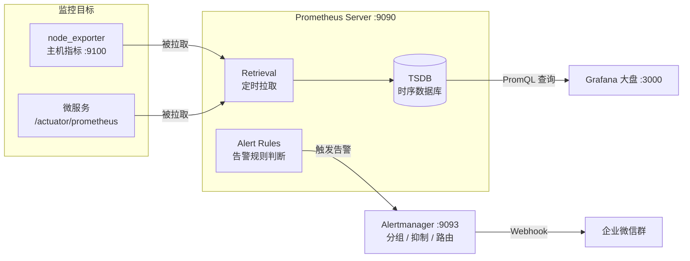

# 监控告警

微服务上量之后，「服务还活着吗」「这台机器 CPU 是不是满了」「接口怎么突然变慢了」这类问题不能再靠人肉盯。Prometheus + Grafana 是云原生时代事实上的监控标准：**Prometheus 负责采集和存储指标，Grafana 负责可视化，Alertmanager 负责把告警推到企业微信**，构成一套完整的「采集 → 存储 → 展示 → 告警」闭环。

本文用 Docker Compose 搭建一套本地监控平台，然后完成三个递进实战：主机监控大盘、微服务指标接入、CPU 告警推送到企业微信。

## 一、组件介绍

| 组件         | 作用                             | 类比               |
| ------------ | -------------------------------- | ------------------ |
| Prometheus   | 定时拉取指标、时序存储、告警判断 | 监控系统的"大脑"   |
| Exporter     | 把监控对象的指标暴露成 HTTP 接口 | 各种"传感器"       |
| Grafana      | 可视化大盘，对接 Prometheus 数据 | "仪表盘"           |
| Alertmanager | 告警分组、抑制、路由、通知       | "告警调度员"       |

> Grafana 官方仪表盘模板大全：https://grafana.com/grafana/dashboards/ ，大量现成模板导入即用，不必从零画图。

## 二、整体架构


Prometheus 的核心特点是 **Pull 模型**：由 Prometheus 主动定时拉取各目标的 `/metrics` 接口，而不是目标主动上报。

本文搭建的监控链路如下：



数据流向分两条：

1. **看板链路**：Exporter 暴露指标 → Prometheus 拉取存 TSDB → Grafana 用 PromQL 查询展示。
2. **告警链路**：Prometheus 按 rules 文件周期性评估表达式 → 命中条件推送 Alertmanager → 经分组/去重后通知企业微信。

## 三、Docker Compose 快速部署

### 目录结构

```text
prometheus-grafana/
├── docker-compose.yml
├── prometheus/
│   ├── prometheus.yml
│   └── rules/
│       └── host-alerts.yml
├── alertmanager/
│   └── alertmanager.yml
└── grafana/
    └── data/
```

### docker-compose.yml

```yaml
version: "3.8"

services:
  prometheus:
    image: prom/prometheus:latest
    container_name: prometheus
    volumes:
      - ./prometheus/prometheus.yml:/etc/prometheus/prometheus.yml
      - ./prometheus/rules:/etc/prometheus/rules
    ports:
      - "9090:9090"
    command:
      - "--config.file=/etc/prometheus/prometheus.yml"
    restart: unless-stopped

  node-exporter:
    image: prom/node-exporter:latest
    container_name: node-exporter
    ports:
      - "9100:9100"
    restart: unless-stopped

  alertmanager:
    image: prom/alertmanager:latest
    container_name: alertmanager
    volumes:
      - ./alertmanager/alertmanager.yml:/etc/alertmanager/alertmanager.yml
    ports:
      - "9093:9093"
    restart: unless-stopped

  grafana:
    image: grafana/grafana:latest
    container_name: grafana
    ports:
      - "3000:3000"
    volumes:
      - ./grafana/data:/var/lib/grafana
    environment:
      - GF_SECURITY_ADMIN_USER=admin
      - GF_SECURITY_ADMIN_PASSWORD=admin   # 仅本地学习使用，生产请修改
    restart: unless-stopped
```

### prometheus.yml

```yaml
global:
  scrape_interval: 15s      # 每 15 秒拉取一次指标
  evaluation_interval: 15s  # 每 15 秒评估一次告警规则

rule_files:
  - "/etc/prometheus/rules/*.yml"

alerting:
  alertmanagers:
    - static_configs:
        - targets: ["alertmanager:9093"]

scrape_configs:
  - job_name: "prometheus"
    static_configs:
      - targets: ["localhost:9090"]

  - job_name: "node_exporter"
    static_configs:
      - targets: ["node-exporter:9100"]
```

启动并验证：

```bash
docker compose up -d
```

- Prometheus：`http://localhost:9090`，菜单 **Status → Targets** 里所有 job 状态为 UP 即采集成功
- Grafana：`http://localhost:3000`（admin / admin）

## 四、实战一：主机监控大盘

### 对接数据源

Grafana → **Connections → Data sources → Add data source** → 选择 Prometheus，URL 填：

```text
http://prometheus:9090
```

> 同一 compose 网络内用 service 名互访，不要写 localhost——localhost 指的是 Grafana 容器自己。

### 导入现成仪表盘

**Dashboards → Import**，输入模板 ID **1860**（Node Exporter Full，最经典的主机监控模板），选择刚才的数据源，CPU / 内存 / 磁盘 / 网络全景大盘即刻生成。

### 常用 PromQL 速查

| 需求       | 表达式                                                       |
| ---------- | ------------------------------------------------------------ |
| CPU 使用率 | `100 - (avg by(instance)(rate(node_cpu_seconds_total{mode="idle"}[1m])) * 100)` |
| 内存使用率 | `(1 - node_memory_MemAvailable_bytes / node_memory_MemTotal_bytes) * 100` |
| 磁盘使用率 | `100 - (node_filesystem_avail_bytes{mountpoint="/"} / node_filesystem_size_bytes{mountpoint="/"} * 100)` |
| 服务是否存活 | `up`（1 = 正常，0 = 挂了）                                   |

## 五、实战二：微服务指标接入

以 Spring Boot 为例，两步让微服务暴露指标：

1. 引入依赖 `spring-boot-starter-actuator` + `micrometer-registry-prometheus`
2. 配置暴露端点：

```yaml
management:
  endpoints:
    web:
      exposure:
        include: prometheus
```

服务启动后访问 `/actuator/prometheus` 即可看到 JVM、HTTP 请求等指标。然后在 prometheus.yml 中追加 job：

```yaml
  - job_name: "order-service"
    metrics_path: "/actuator/prometheus"
    static_configs:
      - targets: ["宿主机IP:8080"]
```

重载配置（`curl -X POST http://localhost:9090/-/reload` 或重启容器）后，Grafana 导入 JVM 模板 **4701**，即可监控服务的堆内存、GC、线程数。其他语言同理：FastAPI 用 `prometheus_client`，Nginx 用 `nginx-prometheus-exporter`，本质都是暴露 `/metrics` 让 Prometheus 来拉。

## 六、实战三：告警闭环 —— Alertmanager + 企业微信

监控平台没有告警，等于只装了摄像头没人看。下面实现：**CPU 使用率连续 1 分钟超过 80% → 企业微信群收到告警。**

### 告警规则

`prometheus/rules/host-alerts.yml`：

```yaml
groups:
  - name: host-alerts
    rules:
      - alert: HighCpuUsage
        expr: 100 - (avg by(instance)(rate(node_cpu_seconds_total{mode="idle"}[1m])) * 100) > 80
        for: 1m
        labels:
          severity: warning
        annotations:
          summary: "主机 {{ $labels.instance }} CPU 使用率过高"
          description: "CPU 使用率已连续 1 分钟超过 80%，当前值 {{ $value | humanize }}%"
```

### Alertmanager 配置企业微信通知

`alertmanager/alertmanager.yml`（使用 Alertmanager 原生企业微信支持，需先在企业微信后台创建自建应用）：

```yaml
global:
  resolve_timeout: 5m

route:
  receiver: wechat
  group_by: ["alertname", "instance"]
  group_wait: 30s        # 同组告警等待 30s 聚合发送，避免刷屏
  group_interval: 5m
  repeat_interval: 4h    # 同一告警未恢复，4 小时重复提醒一次

receivers:
  - name: wechat
    wechat_configs:
      - corp_id: "你的企业ID"
        corp_secret: "自建应用的Secret"
        agent_id: "自建应用的AgentId"
        to_user: "@all"
        message: '{{ range .Alerts }}[{{ .Labels.severity }}] {{ .Annotations.summary }}\n{{ .Annotations.description }}{{ end }}'
```

重启后可在 Prometheus 的 **Alerts** 页看到规则状态：`Inactive → Pending（满足条件但未满 for 时长）→ Firing（已触发）`。想快速验证，可以把阈值临时改成 `> 1` 再用压测工具跑高 CPU。

> 如果用的是企业微信**群机器人**（只有 webhook 地址、没有自建应用），Alertmanager 的 webhook 格式与群机器人不兼容，中间需要一个格式转换器（如 prometheus-webhook-wechat），场景允许的话推荐直接用上面的原生 wechat_configs。

## 七、常见问题

### Grafana 启动报数据目录无权限

报错信息：

```text
GF_PATHS_DATA='/var/lib/grafana' is not writable
mkdir: can't create directory '/var/lib/grafana/plugins': Permission denied
```

原因：Grafana 容器内以 UID 472 的用户运行，宿主机挂载目录 `grafana/data` 没有该用户的写权限。给宿主机目录授权即可：

```bash
mkdir -p grafana/data
sudo chown -R 472:472 grafana/data
sudo chmod -R 755 grafana/data
```

## 八、小结

- Prometheus 的核心是 **Pull 模型 + PromQL + 时序存储**，理解这三点就看懂了整个生态。
- Grafana 不必手画大盘，官方模板库（1860 主机监控、4701 JVM 监控）覆盖了大部分场景。
- 监控的价值最终落在**告警闭环**上：规则判断在 Prometheus，通知调度在 Alertmanager，别混淆两者的职责。
- 与上一篇 [ELK 日志平台](ELK.md) 搭配，就是微服务可观测性的两条腿：**指标看趋势，日志查细节**。

## 参考资料

- [Grafana 对接 Prometheus 数据源](https://blog.csdn.net/lwxvgdv/article/details/140324500)
- [Prometheus 监控 Nginx Ingress 网关最佳实践](https://www.cnblogs.com/alisystemsoftware/p/17283207.html)
